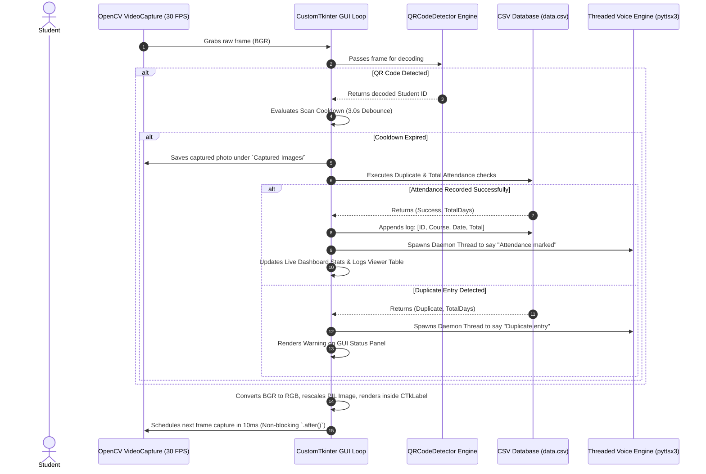

# 🎓 Smart Attendance Tracker

> **A premium, high-performance desktop application for real-time QR-based attendance tracking, utilizing computer vision, async GUI rendering, and automated bulk data management.**

[](https://www.python.org/)
[](https://github.com/TomSchimansky/CustomTkinter)
[](https://opencv.org/)
[](#-async-speech-engine)
[](https://opensource.org/licenses/MIT)

Smart Attendance Tracker is a professional desktop solution designed for schools, universities, and corporate workspaces. It automates attendance tracking using computer vision and QR codes, storing records securely in a portable CSV database.

---

## 🏗️ System Architecture & Data Flow

To ensure the desktop GUI remains responsive at 30+ FPS while capturing webcam frames, processing computer vision algorithms, and performing text-to-speech, the application is built on an **Asynchronous Multi-Threaded Event Loop**.

The diagram below outlines the system data flow when taking attendance:



---

## ✨ Core Engineering Features

### 1. Modern CustomTkinter Dashboard UI
* **Dynamic Theme Engines:** Clean Light and Dark modes with responsive color pallets that automatically adapt to native OS themes.
* **Live Statistics:** Dynamic dashboard displaying Total Registered Students, Total System Records, and Today's Attendance count.
* **Scrollable Action Feed:** Live-updating feed showing the most recent scans in real-time.

### 2. Non-Blocking Embedded Camera Stream
* **Asynchronous GUI Rendering:** Instead of utilizing blocking `while True` loops and separate OpenCV window popups (`cv2.imshow`), the camera stream is grabbed and converted into `PIL` images on the fly. It is rendered directly within a `ctk.CTkLabel` container using Tkinter's `.after(10)` loop.
* **3-Second Scan Debouncer:** Prevents rapid duplicate scans for the same student code while maintaining continuous scanner operations.

### 3. Smart Bulk CSV Registration Portal
* **Automated Column Mapping:** A custom parser checks CSV headers for labels like `Student ID`, `ID`, `Roll No`, `Roll_No`, and `student_id`. If no header matches, it intelligently falls back to parsing the first column.
* **Multi-threaded CSV Processing:** Spawns a background thread to read and write QR codes in bulk. Progress is reported back to the GUI thread via safe callbacks, driving a smooth visual progress bar without freezing the window.
* **Registration QR Previews:** Single student registration immediately saves and displays a live visual rendering of the generated QR code directly in the viewport.

### 4. Searchable & Theme-Adaptive Database Table
* **Spreadsheet Log Viewer:** Integrates a styled `ttk.Treeview` to display all attendance records.
* **Adaptive styling:** Treeview style mappings automatically update background colors, row heights, and highlights when switching between Light and Dark mode.
* **Real-time Live Filter:** Instantly filters thousands of database log entries by student ID or course name as you type.

### 5. Multi-Threaded Audio Feedback
* Spawns voice notifications inside background daemon threads. This avoids the standard `pyttsx3` COM-port locks, keeping the video stream and GUI input fully responsive during spoken words.

---

## 📁 Repository Layout

```
Smart-Attendance-Tracker/
│
├── Main.pyw                # Main Application (Modern GUI, Async Engine, Backend Controllers)
├── data.csv                # Attendance Log Database (Auto-created, portable CSV structure)
│
├── Student QR/             # Generated Student QR Codes folder
│   ├── [StudentID].png
│   └── ...
│
└── Captured Images/        # Captured verification photos folder
    ├── [Date]_[StudentID].jpg
    └── ...
```

---

## 🛠️ Technical Highlights & Design Patterns

### 1. Non-Blocking Frame Updates (Async UI Loop)
```python
def update_webcam_feed(self):
    if not self.is_scanning or self.cap is None:
        return
        
    ret, frame = self.cap.read()
    if ret:
        # 1. Decodes QR codes in the webcam frame
        qr_results = custom_decode(frame)
        # 2. Performs scan debounce and writes to CSV ...
        
        # 3. Formats BGR to RGB and renders inside Tkinter
        rgb_frame = cv2.cvtColor(frame, cv2.COLOR_BGR2RGB)
        pil_img = Image.fromarray(rgb_frame)
        ctk_img = ctk.CTkImage(light_image=pil_img, dark_image=pil_img, size=(500, 375))
        self.camera_label.configure(image=ctk_img, text="")
        self.camera_label.image = ctk_img
        
    # Re-schedule frame updates asynchronously in 10ms
    self.after(10, self.update_webcam_feed)
```

### 2. Thread-Safe GUI Progress Updating
```python
def bulk_register_thread(self, filepath):
    try:
        def progress_cb(current, total):
            val = current / total
            # Safely schedules GUI updates back on the main Tkinter thread
            self.after(0, lambda: self.bulk_progress.set(val))
            self.after(0, lambda: self.bulk_status_label.configure(text=f"Processed: {current} of {total}..."))
            
        success_count, msg = import_csv_students(filepath, progress_cb)
        self.after(0, lambda: messagebox.showinfo("Success", f"{success_count} students registered!"))
    except Exception as e:
        self.after(0, lambda: messagebox.showerror("Error", str(e)))
```

---

## ⚡ Quick Start & Setup Guide

### Prerequisites
* Python 3.8+ installed (Python 3.13 recommended)
* A built-in or external USB Webcam

### Installation & Setup

#### Option A: One-Click Setup (Windows Recommended)
Simply double-click the **`setup.bat`** file in the root directory. It will:
1. Detect and verify your Python & pip environment.
2. Upgrade `pip` to the latest version.
3. Automatically install all required dependencies from `requirements.txt`.
4. Prompt you to launch the application immediately.

#### Option B: Manual Installation
1. Clone the repository to your local machine:
   ```bash
   git clone https://github.com/yourusername/Smart-Attendance-Tracker.git
   cd Smart-Attendance-Tracker
   ```
2. Install the dependencies using pip:
   ```bash
   pip install -r requirements.txt
   ```

### Running the Application
Launch the graphical app:
* Double-click `Main.pyw` or run from terminal:
  ```bash
  python Main.pyw
  ```

---

## 📊 Database Format

Attendance data is recorded in `data.csv` in the following structure:

| Column | Data Type | Description |
|:---|:---|:---|
| **Student ID** | String (Numeric) | Unique code representing the student |
| **Course Name** | String | Name of the course class scanned under |
| **Date** | String | Date of the session (DD_MM_YYYY format) |
| **Total Attended** | Integer | Cumulative attendance count of the student for this course |

---

## 🚀 Recruiter Checklist: Production Enhancements
If reviewing this project as a portfolio item, the architecture was deliberately designed for easy expansion:
- [ ] **SQL Database Backend:** Replace the lightweight `data.csv` files with a PostgreSQL/SQLite database managed via SQLAlchemy.
- [ ] **Hardware Acceleration:** Implement OpenCV CUDA filters or PyTorch pipelines to enable face recognition as a secondary validation factor.
- [ ] **API Cloud Syncing:** Forward scanned entries to a remote backend server via HTTP requests using `httpx` or `requests`.
